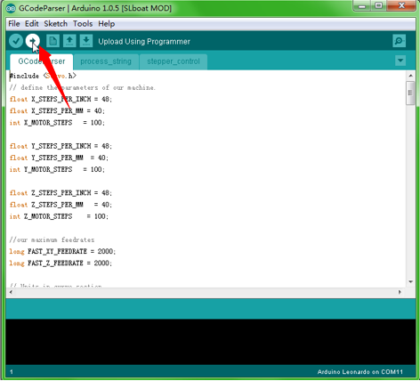
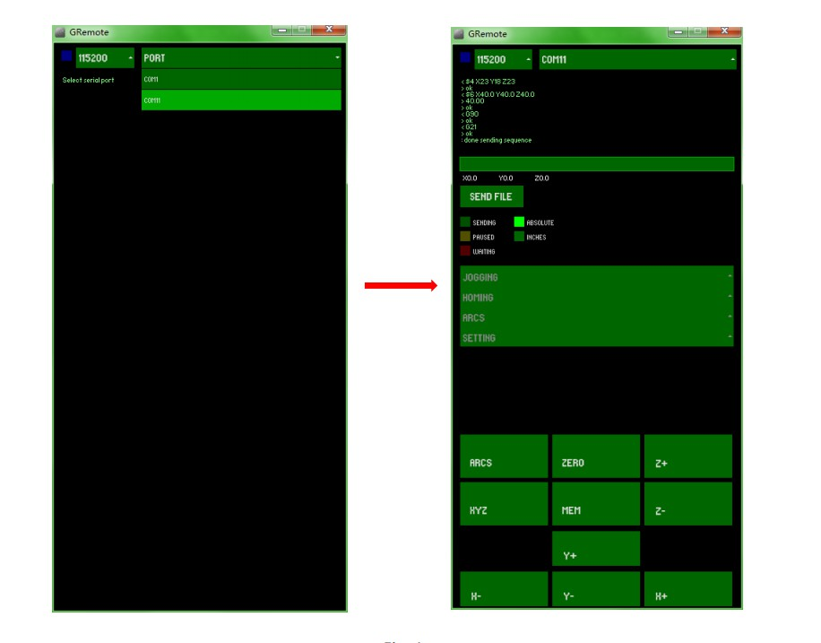
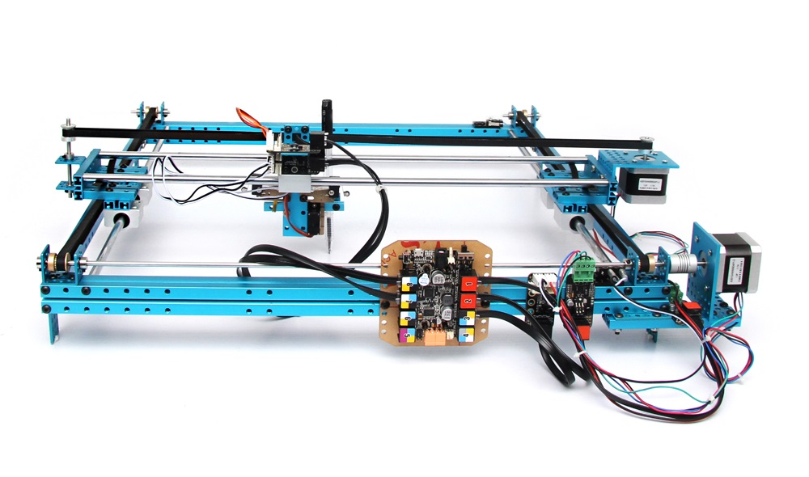

The package consists of the software(Arduino firmware and GRemote), structure assembly instruction and program instruction.

###Brief Procedure

1. Download and install Arduino-1.0.5，http://arduino.cc/en/Main/Software

2. Download the software package and decompress it，https://github.com/Makeblock-official/XY-Plotter-2.0/archive/master.zip

3. Connect Me baseboard to computer with micro USB cable.

4. Open GCodepraser->GCodeParser.ino by Arduino IDE. Click Tools->Serial Ports, choose COM XX (Not COM1 and COM2). Click Tools->Boards, choose Arduino Leonardo. At last, click "upload" button on the right-top corner.
                                                                                  

5. Close Arduino IDE, open GRemoteFull->GRemote.bat. 

6. Set the COM port, then GRemote will show you the UI as follows. That all for this part.

7. Now, you could control the XY-Plotter 2.0 by mouse and keyboard. And, you can also run it with Gcode. You could generate Gcode file by another software (dxf2gcode(https://code.google.com/p/dxf2gcode/) or any other capable). You should save the Gcode file with .cnc and open it by GRemote.

For more details, please refer to the software instruction.

###How to DIY

If you want change the source code, you could find it in GRemotFull/source/GRemote.pde.

1. Download and install Processing-2.1.2. http://processing.org/
2. Install the Processing library, controlP5 -- copy the whole folder to C:\Users\xxx\Documents\Processing\libraries
3. Open the GRemote.pde by Processing, DIY the code and click the “run” button to test it.

###Learn more from Makeblock official website: www.makeblock.com
